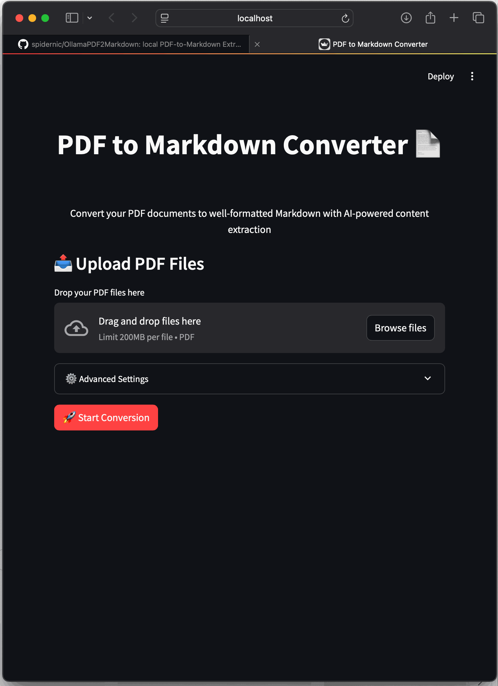

# PDF-to-Markdown Extractor with Multimodal Model Processing

## Overview
This Python application converts PDF files into markdown by first converting pages into images and then extracting content from those images using a multimodal model. The extracted content is presented in markdown format, making it suitable for review and further editing. The tool is ideal for extracting tabular and textual information from large PDF files, producing a consolidated, structured markdown report that preserves the original document's order and format.

The application comes in two versions:
1. **GUI Version**: A user-friendly interface built with Streamlit



2. **Command Line Version**: A script-based version for automation and batch processing


## Key Features
- **User-Friendly GUI**: Simple drag-and-drop interface for PDF files with progress tracking
- **Local LLM Integration**: Uses local Large Language Models (LLMs) powered by Ollama (from [Ollama.com](https://ollama.com)), leveraging the latest Llama 3.2 for efficient and private image content extraction
- **PDF to Image Conversion**: Efficiently converts each page of a PDF into an image for subsequent analysis
- **Multimodal Model Integration**: Uses a vision-capable model to extract text, tables, and other content from images in markdown format
- **Batch Processing**: Handles multiple PDF files, extracting data from each page and maintaining content order
- **Markdown Report Generation**: Creates a detailed markdown report, with tables and text extracted from the original PDF for easy readability and review
- **Advanced Settings**: Configurable options for model selection, image format, and quality

## Requirements
To use this application, you need to install the following dependencies:

- **Python 3.x**
- **pip** (Python package manager)

### Python Libraries
```sh
pip install streamlit pdf2image ollama pillow
```

### Additional Requirements
- **Poppler**: Required for `pdf2image` to convert PDF files to images
  - On Ubuntu/Debian: `sudo apt-get install poppler-utils`
  - On macOS: `brew install poppler`
- **Ollama**: Required for running the local LLM. Install from [Ollama.com](https://ollama.com)

## Usage

### GUI Version
To launch the graphical interface:
```sh
streamlit run pdf_to_markdown_gui.py
```

The GUI provides an intuitive interface with:
- Drag-and-drop PDF file upload
- Real-time progress tracking
- Advanced settings for customization:
  - Model selection
  - Image format and quality
  - Output directory configuration
- Preview of generated markdown
- Download option for the converted file

### Command Line Version
For automation and batch processing:
```sh
python pdf_to_image_extractor.py
```

## Script Configuration
The GUI version allows configuration through the interface. For the command-line version, you can modify these parameters in the script:
- `src_directory`: Directory containing the PDF files (default: `./data`)
- `tgt_directory`: Directory where the converted images are saved (default: `./temp`)
- `output_directory`: Directory where the final markdown report is saved (default: `./output`)
- `model_name`: The model used for image processing (default: `'llama3.2-vision:11b-instruct-q8_0'`)

## Author Information
- **Author**: Nic Cravino
- **Email**: [spidernic@me.com](mailto:spidernic@me.com) 
- **LinkedIn**: [Nic Cravino](https://www.linkedin.com/in/nic-cravino)
- **Date**: October 30, 2024

## License
This project is licensed under the Apache License, Version 2.0. You are free to use, distribute, and modify the software under the following conditions:

- **Freedom of Use**: The software can be used for personal, academic, or commercial purposes.
- **Modification and Distribution**: You may modify and distribute the software, provided you include a copy of the Apache 2.0 license and indicate any changes.
- **Attribution**: Please acknowledge the original author when redistributing the software or modified versions.
- **Liability Disclaimer**: The software is provided "as is," without warranties or conditions of any kind.

For full details, see the [Apache License 2.0](https://www.apache.org/licenses/LICENSE-2.0).

## Acknowledgments
This script uses local Large Language Models (LLMs) from Ollama (available at [Ollama.com](https://ollama.com)), incorporating the latest Llama 3.2 model for advanced multimodal processing. Additionally, it utilizes the `pdf2image` library for PDF processing and the `ollama` Python library for model interaction. Many thanks to the developers of these tools for their invaluable contributions to open-source software.
This script utilizes the `pdf2image` library for PDF processing and a multimodal model (`ollama`) for image content extraction. Many thanks to the developers of these tools for their invaluable contributions to open-source software.

## Future Improvements
- **Parallel Processing**: Add support for parallel processing of images to improve efficiency.
- **Error Handling**: Enhance error handling, particularly for malformed PDFs or unexpected model responses.
- **Extended Output Formats**: Provide additional output formats, such as JSON or CSV, for structured data extraction.

## Contact
Feel free to reach out if you have any questions, suggestions, or issues with the script. Contributions are welcome!

---

Happy extracting!
